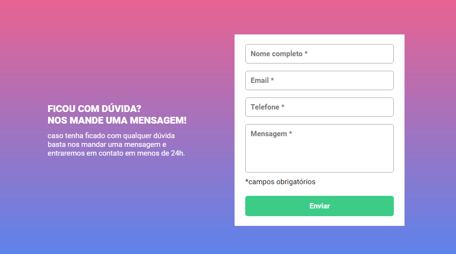
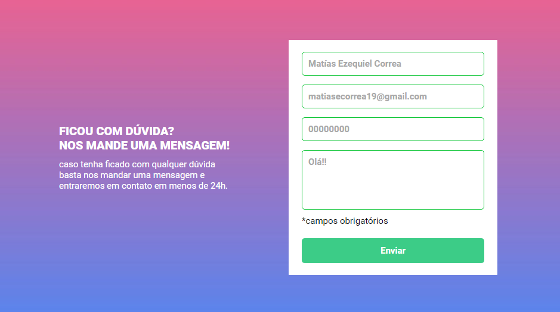
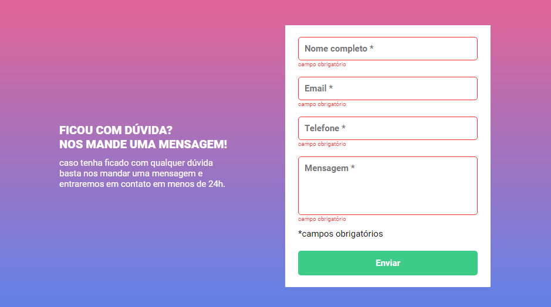
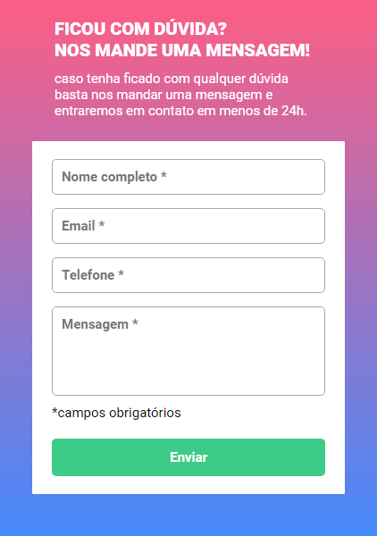

# QUEST sobre HTML + CSS + JS INTERMEDIÁRIO | DevQuest 🚀

* Um desafio proposto no curso DevQuest sobre um Formulário com validação.

* Para aprimorar e consolidar os conhecimentos e habilidades adquiridos nos módulos de HTML , CSS e JAVASCRIPT do curso. 

* A validação do formulário feita com Javascript puro.

## Design:
* Desktop:

* Mobile:

## Tecnologias utilizadas:

 * HTML
 * CSS
 * JAVASCRIPT

 ### Pra entrar em contato, veja as redes abaixo!
 

 
  
  
   

